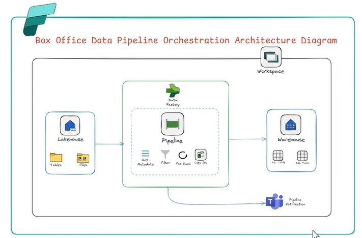

# 🎬 India Box Office Data Pipeline Orchestration

A fully orchestrated end-to-end data pipeline for collecting, processing, and analyzing Indian box office performance data. This project automates data ingestion, transformation, and storage, making it easy to track and analyze movie collections across Bollywood and regional film industries.

---

## 📁 Project Structure

```
India-BoxOffice-Data-Pipeline-Orchestration/
├── Datasets/               # Raw and processed box office datasets
├── Pipeline/               # Pipeline scripts and orchestration logic
└── README.md
```

---

## 🚀 Overview

This project builds a data pipeline that:

- **Ingests** raw Indian box office data (collections, budgets, release info, etc.)
- **Orchestrates** the pipeline stages using a workflow manager
- **Stores** processed data in a structured format for downstream analytics

---

## 🛠️ Tech Stack

| Category | Tools / Technologies |
|---|---|
| Pipeline Orchestration | Microsoft Fabric Pipeline |
| Storage | Lakehouse / Warehouse  |
| Version Control | Git & GitHub |

> **Note:** Update the table above to reflect the exact tools used in this project.

---

## ⚙️ Pipeline Architecture

```
Raw Data Source
     │
     ▼
 Ingestion Layer
 (fetch/load raw box office data)
     │
     ▼
 Transformation Layer
 (Filter the csv files, based on category)
     │
     ▼
 Storage Layer
 (save to warehouse/lakehouse for analysis)
     │
     ▼
 Orchestration
 (schedule & automate end-to-end pipeline)
     │
     ▼
 Notified by Teams for daily/weekly pipeline status updates
```



---

## 📊 Dataset

The `Datasets/` directory contains box office data including:

- Movie titles and release dates
- Opening day / weekly / lifetime collections
- Budget and ROI figures
- Language and industry (Bollywood, Tollywood, Kollywood, etc.)
- Domestic vs. overseas gross

---

## 🔧 Setup & Installation

### Prerequisites

- Microsoft Fabric (free account)

### Steps

1. **Clone the repository**
   ```bash
   git clone https://github.com/Pratik5767/India-BoxOffice-Data-Pipeline-Orchestration.git
   cd India-BoxOffice-Data-Pipeline-Orchestration
   ```

2. **Import dependencies**
   ```
   Import the pipline json file in Microsoft Fabric and setup the required configuration.
   ```

3. **Run the pipeline**
   ```
   Run the pipeline in Microsoft Fabric to execute the end-to-end data processing workflow.
   ```

---

## 📌 Features

- ✅ Automated data collection from box office sources
- ✅ Modular pipeline stages (ingest → transform → store)
- ✅ Orchestrated workflow with scheduling support
- ✅ Structured datasets ready for analysis or visualization
- ✅ Setup teams notifications for pipeline status updates

---

## 📈 Sample Use Cases

- Track all-time highest-grossing Indian films
- Compare collection trends across different industries
- Analyze budget vs. collection ratios
- Monitor weekly box office performance over time

---

## 🤝 Contributing

Contributions are welcome! Feel free to open an issue or submit a pull request.

1. Fork the repository
2. Create a feature branch (`git checkout -b feature/your-feature`)
3. Commit your changes (`git commit -m 'Add your feature'`)
4. Push to the branch (`git push origin feature/your-feature`)
5. Open a Pull Request

---

## 📄 License

This project is open source and available under the [MIT License](LICENSE).

---

## 👤 Author

**Pratik** — [@Pratik5767](https://github.com/Pratik5767)